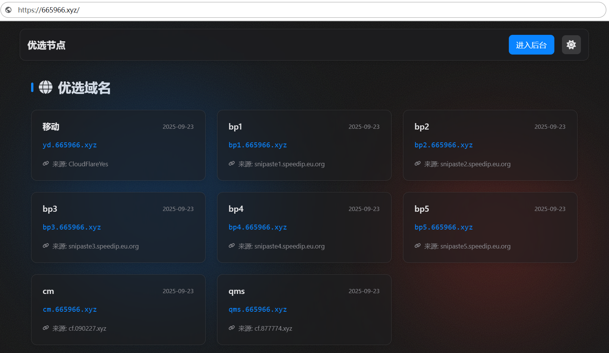
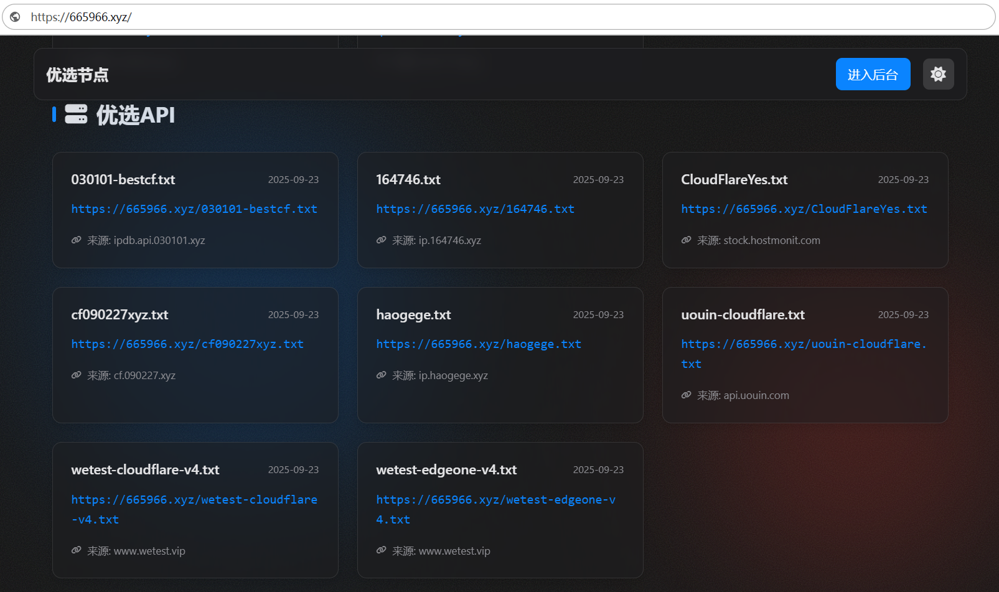

---

### 🙏 特别鸣谢   CMliu 频道

首先，特别感谢 **CMliu** 频道。本项目中使用的部分核心 `Snippets` 代码及 `ProxyIP` 均源自该频道。

原项目旨在实现域名解析的克隆功能。在日常交流中，我们注意到许多朋友对如何自定义 `Snippets` 节点内容或进行 IP 优选有诸多疑问。为此，我们在原项目的基础上，特别增设了代理功能板块，希望能为大家提供一个方便研究和学习的平台。

---

  
  
<strong>一个能让你轻松“白嫖”别人优选域名的 Cloudflare Worker 工具</strong>

  

---

  
   
  

---

## 🚀 项目是干嘛的？

简单来说，这个项目能让你**直接克隆任何一个优选好的域名**（比如别人花时间筛选的 CDN 加速域名），并把它所有的 DNS 解析记录实时同步到**你自己的域名**上。

-   **🎯 核心用途：** **域名克隆，实现白嫖。** 看到了好的优选域名？直接输入，一键克隆，别人的优选成果就变成了你的。
-   **📦 额外福利：** **自建 IP 库。** 自动从网上抓取各种优选 IP，并存到你自己的 GitHub 仓库里，形成一个私有的、随时可用的 IP Hub。

所有操作都在 Cloudflare 上完成，免费、高效且稳定。

## ✨ 主要功能

| 功能点                   | 图标 | 描述                                                                                                                              |
| -------------------------- | :--: | --------------------------------------------------------------------------------------------------------------------------------- |
| **一键域名克隆 (核心)**    |  🔄  | **深度克隆** CNAME 记录找到最终 IP，并**实时同步**源站变化，实现全自动“白嫖”。                                                       |
| **聚合 IP 到 GitHub**      |  📦  | **自动化**从多个公开源抓取最新 IP 列表，并自动推送到你自己的 GitHub 仓库。                                                         |
| **订阅器友好 API**         |  📡  | **直接访问**同步到 GitHub 的 IP 文件。格式为 `你的 Worker 首页 URL / GitHub 文件路径`，可直接用于各种订阅器。                             |
| **精美的管理后台**         |  🎨  | **简单易用**的密码保护后台，所有配置点点鼠标即可完成，无需懂代码。                                                                  |
| **公开展示页**             |  🌐  | 一个简洁漂亮的首页，展示你克隆的所有域名和 IP 库地址，方便分享和使用。                                                              |

---

## 🛠️ 网页部署指南 (纯小白教程)

整个部署过程都在 Cloudflare 网站上完成，不需要任何命令行工具。请严格按照以下流程操作：

**① 创建 Worker ➡️ ② 创建并绑定 D1 ➡️ ③ 初始化并配置 ➡️ ④ 设置定时器 (关键!)**

### ① 创建 Worker

1.  登录 [Cloudflare 控制台](https://dash.cloudflare.com/)，进入左侧菜单的 **Workers & Pages**。
2.  点击 **创建应用程序 (Create Application)** > **创建 Worker (Create Worker)**。
3.  为你的 Worker 取一个名字（例如 `cf-dns-clon`），然后点击 **部署 (Deploy)**。
4.  部署成功后，点击 **编辑代码 (Edit code)**。
5.  将本项目提供的 `src/index.js` 文件中的**所有代码**，完整地复制并粘贴到代码编辑器中，覆盖掉原有的示例代码。
6.  点击右上角的 **部署 (Deploy)** 按钮。

### ② 创建 D1 数据库并绑定

1.  在左侧菜单中，找到并进入 **D1**。
2.  点击 **创建数据库 (Create database)**，填写数据库名称（例如 `wuya-db`），然后点击 **创建 (Create)**。
3.  返回到你的 Worker，进入 **设置 (Settings)** > **变量 (Variables)**。
4.  找到 **D1 数据库绑定 (D1 Database Bindings)**，点击 **添加绑定 (Add binding)**。
5.  **变量名称 (Variable name)** 必须填写 `WUYA` (全大写)。
6.  在 **D1 数据库 (D1 Database)** 下拉列表中，选择你刚刚创建的 `wuya-db`。
7.  点击 **保存并部署 (Save and deploy)**。

  

### ③ 初始化和配置

1.  **设置管理员密码**
    -   访问你的 Worker URL (例如 `https://cf-dns-clon.your-username.workers.dev`)。
    -   页面会引导你设置一个安全的管理员密码。

2.  **获取 API 密钥**
    -   **Cloudflare API (Zone ID 和 API Token):**
        -   **区域 ID (Zone ID):** 在 Cloudflare 域名概述页的右下角复制。
        -   **API 令牌 (API Token):** 前往 **API 令牌** 页面，使用 **“编辑区域 DNS”** 模板为你的域名创建一个新令牌。*（注意：令牌只显示一次，请妥善保管）*
    -   **GitHub Token:**
        -   登录 [GitHub](https://github.com/settings/tokens/new)，点击 **Generate new token (classic)**。
        -   勾选 `repo` 权限，建议设置永不过期，然后生成并复制令牌。*（同样，只显示一次）*

3.  **登录后台进行最终配置**
    -   访问你的 Worker URL 并在后面加上 `/admin` (例如 `https://.../admin`)，使用你的密码登录。
    -   进入 **系统设置** 页面，将上面获取到的所有信息填入对应的输入框中。
    -   点击 **保存设置**。

### ④ 设置定时触发器 (关键步骤！)

> ## ⚠️ **非常重要：必须设置定时触发器，否则无法自动同步！**
>
> 1.  返回到你的 Worker，进入 **设置 (Settings)** > **触发器 (Triggers)**。
> 2.  在 **Cron 触发器 (Cron Triggers)** 部分，点击 **添加 Cron 触发器 (Add Cron Trigger)**。
> 3.  **Cron 表达式** 选择 **每分钟 (`* * * * *`)**，以确保同步的及时性。
> 4.  点击 **添加触发器 (Add trigger)** 保存。

  

---

  🎉 **部署完成！现在去“域名克隆”页面，开始你的“白嫖”之旅吧！** 🎉

### ⚠️ **【重要声明】** ⚠️

本项目/本教程中的所有代码和信息仅供学习和研究之用。

*   **请勿**用于商业或非法目的，否则后果自负。
*   代码来源于互联网，如有侵权请联系删除。
*   项目作者不对任何因使用本项目代码而导致的任何损失或法律纠纷承担责任。
*   使用本项目代码即表示您同意并接受本声明。

**请在遵守您当地法律法规的前提下使用。**
